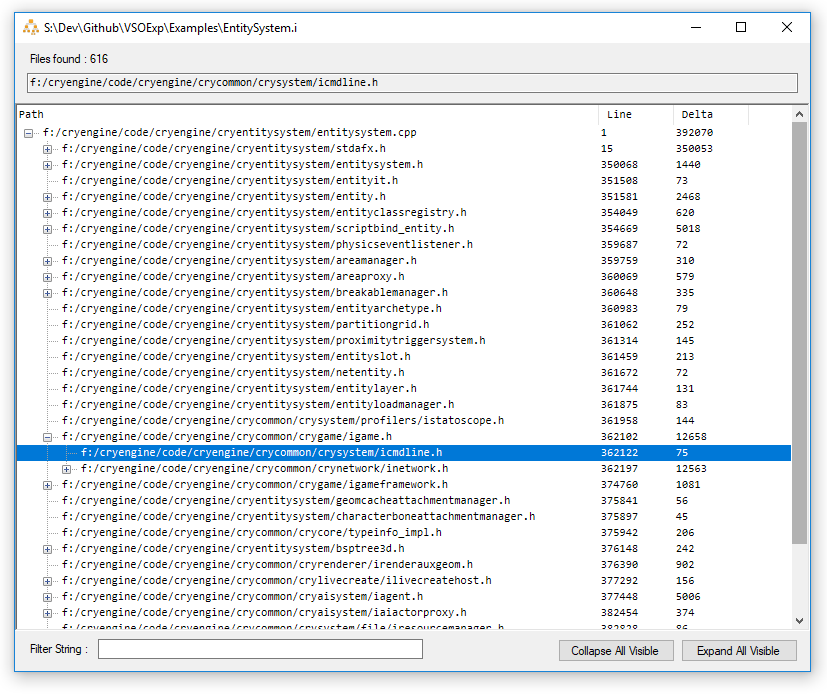
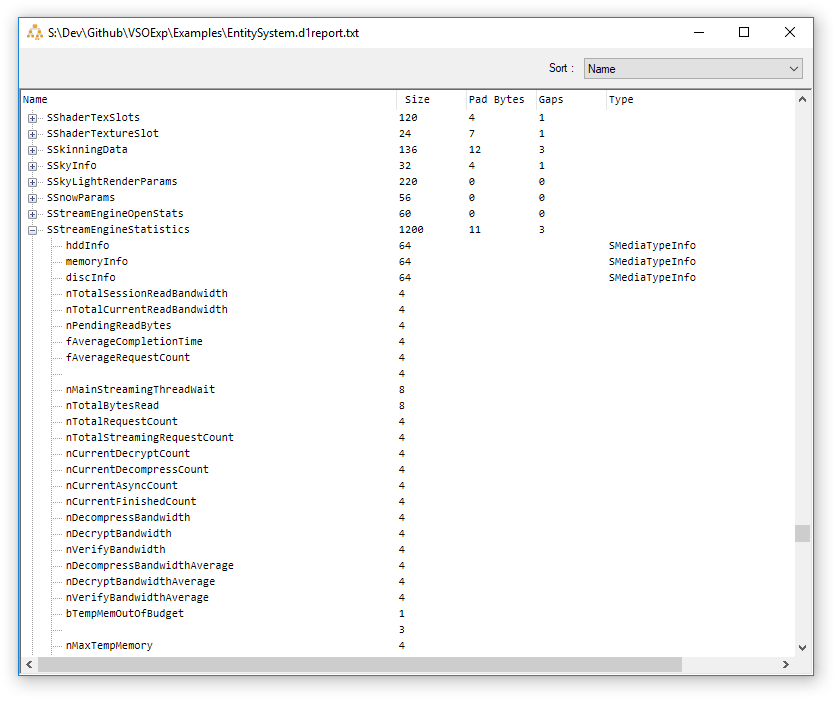

# VSOExp
A quick tool to allow parsing and exploration of a few obtuse Visual Studio outputs. Currently:

- - -

### .i preprocessor output 

View the include hierarchy as a tree and track where the bulky code is being pulled in from. See line deltas per file and filter by name.

- - -

### /d1reportAllClassLayout

Use an [unsupported compiler flag](http://ofekshilon.com/2010/11/07/d1reportallclasslayout-dumping-object-memory-layout/) to vomit up the class layout for your code in a totally wonky and inconsistent format. VSOExp will parse, unpack and search through the potentially multi-hundred-megabyte text explosion in a much nicer fashion.
